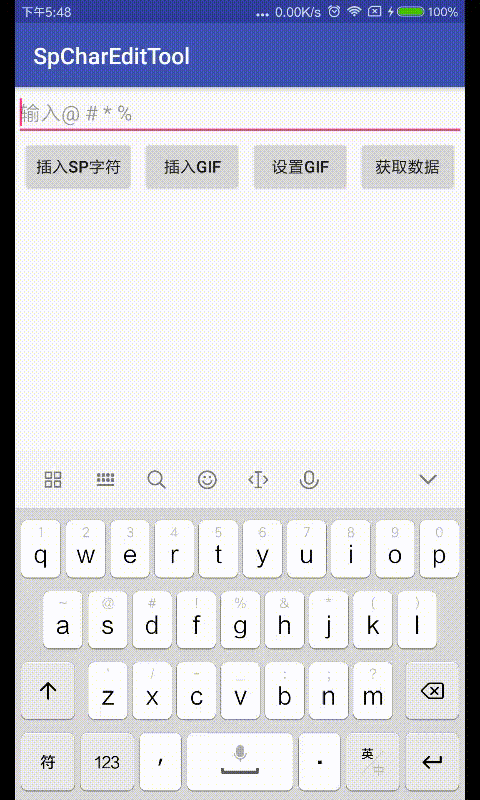
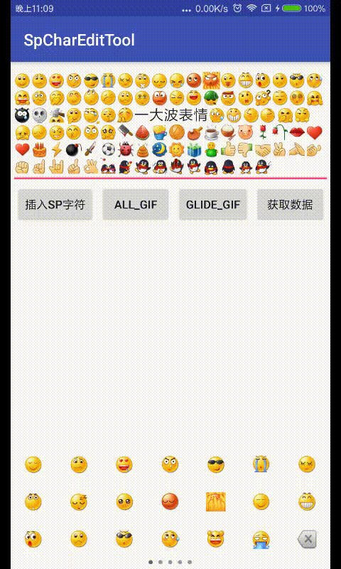

# 介绍

* `SpEditText`——输入@xxx #话题#等特殊字符，实现整体删除，文字高亮等功能的自定义EditText
* `GifTextUtil`——一个帮助在TextView的图文混排中高效显示gif的工具类

## 截图



# 使用说明  

## Gradle

##

* root build.gradle

```
	allprojects {
		repositories {
			...
			maven { url 'https://jitpack.io' }
		}
	}
```
* dependency

[](https://jitpack.io/#sunhapper/SpEditTool)
```
dependencies {
	        compile 'com.github.sunhapper:SpEditTool:{last version}'
	}
```

## xml

```
<com.sunhapper.spedittool.view.SpEditText
    android:id="@+id/spEdt"
    app:react_keys="#*%@"
    app:sp_mode="breakable"
    android:layout_width="match_parent"
    android:layout_height="wrap_content"/>
```
* app:react_keys--要响应的字符列表,也可以在java代码中用setReactKeys设置
* app:sp_mode
  * "integrated"表示完整删除
  * "breakable"普通删除，当完整性被破坏，对应的数据和样式会被移除

## java  

### SpEditText

* 设置要响应的字符列表及设置回调
```
//参数为String，会被解析成char[]
spEditText.setReactKeys("@#%*");
spEditText.setKeyReactListener(new KeyReactListener() {
      @Override
      public void onKeyReact(String key) {
        //key被响应的字符,长度为1
        //todo 处理自己的逻辑
      }
    });
```

* 插入特殊字符串
```
spEditText.insertSpecialStr(" @sunhapper ", true, 0, new ForegroundColorSpan(Color.RED));
```

```
  /**
   * 插入特殊字符串
   *
   * @param showContent 特殊字符串显示在文本框中的内容
   * @param rollBack 是否往前删除一个字符，因为@的时候可能留了一个字符在输入框里
   * @param customData 特殊字符串的数据结构
   * @param customSpan 特殊字符串的样式
   */
  public void insertSpecialStr(String showContent, boolean rollBack, Object customData,
      Object customSpan)
```

* 获取SpEditText的数据  

```
//获取到的数据是根据起点位置排过序的
SpData[] spDatas = spEditText.getSpDatas(); 
```

```
  public class SpData {

    /**
     * EditText中显示的内容
     */
    private String showContent;
    /**
     * 插入特殊字符串时传入的代表自定义数据结构的对象
     */
    private Object customData;
    /**
     * 特殊字符串的在完整字符串中的起点
     */
    private int start;
    /**
     * 特殊字符串的在完整字符串中的终点
     */
    private int end;
  }

```

### GifTextUtil
自定义gifDrawable实现 RefreshableDrawable接口
```
public interface RefreshableDrawable {

  boolean canRefresh();

  int getInterval();

  void addCallback(Drawable.Callback callback);

  void removeCallback(Drawable.Callback callback);

}
```

将textView和包含gifDrawable的spannable textView绑定
```
GifTextUtil.setTextWithReuseDrawable(textView, charSequence, false);
```

## proguard

```
-keep class com.sunhapper.spedittool.**{*;}
```

更多详细信息请看demo或者本人简书[https://www.jianshu.com/u/e173cf3c1f1c](https://www.jianshu.com/u/e173cf3c1f1c)
> 欢迎star，提PR、issue